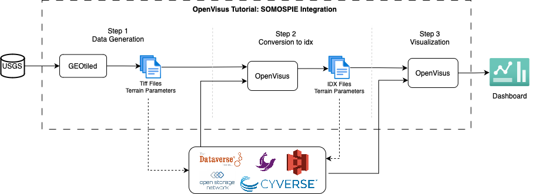

# **OpenVisus Tutorial: Using NSDF for an Earth Science Dataset**

<p align="center">
    
</p>

<p align="center">
<a href="https://www.python.org/downloads/release/python-310/"></a>
<a href="https://dl.acm.org/doi/10.1145/3588195.3595941"></a>
<a href="https://opensource.org/licenses/Apache-2.0"></a>
<a href="https://nsdf-workspace.slack.com/"></a>
<a href="https://www.docker.com"></a>
<a href="https://github.com/astral-sh/ruff"></a>

## Overview

This tutorial demonstrates the power of [OpenVisus](https://github.com/sci-visus/OpenVisus), one of the many [NSDF](https://nationalsciencedatafabric.org/) services to accelerate the accessibility, study, and visualization of scientific data using both public and private clouds. To guide you through the training, we deploy a use case with an Earth Science Dataset generated by [SOMOSPIE](https://globalcomputing.group/somospie/), an ML-based modular SOil MOisture SPatial Inference Engine. Specifically, we focus on the first stage of SOMOSPIE, called [GEOtiled](https://github.com/TauferLab/GEOtiled), that leverages data partitioning to accelerate the computation of terrain parameters from digital elevation models (DEMs), while preserving accuracy. 

This tutorial follows the next architecture:

<p align="center">
    
</p>

---

### Table of content
  1. [Prerequisites](#prerequisites)
  2. [Docker-compose Execution](#docker-compose-execution)
  3. [Installation](#installation)
  4. [Community](#community)
  5. [Related Publications](#related-publications)
  6. [Copyright and License](#copyright-and-license)
  7. [Authors](#authors)
  8. [Acknowledgments](#acknowledgments)

## Prerequisites

To execute this tutorial, you must have Git and Docker Desktop on your computer.  
* **Git**: Follow the instructions [here](https://github.com/git-guides/install-git) and depending on your OS (i.e., Linux, Windows, or Mac) select the installation method. 
* **Docker Desktop**: Follow the instructions [here](https://docs.docker.com/engine/install/) and depending on your OS (i.e., Linux, Windows, or Mac) select the installation method. 

## Docker-compose Execution

There is a Docker container [`globalcomputinglab/somospie_openvisus`](https://hub.docker.com/repository/docker/globalcomputinglab/somospie_openvisus/general) with all the software stack required to facilitate the execution of this tutorial. After installing Docker Desktop as listed in the [Prerequisites](#prerequisites), **please open the Docker Desktop application on your computer.**   

Open your terminal and follow the next instructions to execute the tutorial using the Docker container. 
```
# Clone the repository
git clone https://github.com/nsdf-fabric/Openvisus_Tutorial.git

# Change directory 
cd Openvisus_Tutorial

# Start docker compose
docker-compose up -d
```

Then access the Jupyter lab interface at:

```
# Access to Jupyter Lab (Tutorial.ipynb)
http://127.0.0.1:5000/lab/tree/Tutorial.ipynb
```
Stop the docker container
```
# Stop the docker container
docker-compose down
```

## Installation

There are two ways to install and run the tutorial: i) [Using your local machine](#using-your-local-machine) and ii) [Using a docker container](#using-a-docker-container)

### Using your local machine

[Conda](https://www.anaconda.com/download/) is used to control all the dependencies in this project; the file `environment.yml` contains the list of required versions:

```
# environment.yml

name: somospie
channels:
  - conda-forge
  - defaults
dependencies:
  - python=3.10
  - gdal
  - pip
  - pip:
      - pandas
      - pyspark
      - findspark
      - scikit-learn
      - matplotlib
      - grass-session
      - bokeh
      - xmltodict
      - requests
      - colorcet
      - geopandas
      - tqdm
      - panel
      - jupyterlab
      - grass-session
      - tifffile
      - rasterio
      - imagecodecs
```

To install the dependencies in your local machine, use the following command:

> :bulb: **Note:** Conda is mandatory in this step, use [this](https://www.anaconda.com/download/) link to install it

```
conda env create -f environment.yml
```

Activate the virtual environment:

```
conda activate somospie
```

Install OpenVisus dependencies:

```
# use this file to install openvisus in your local machine
./setup_openvisuspy.sh
```

Run the Jupyter Notebook and follow the internal instructions:

```
jupyter notebook Tutorial.ipynb
```

### Using a Docker container

To build the docker image in your local machine:

```
docker build --platform linux/amd64 -f globalcomputinglab/somospie_openvisus .
```

To pull the image from Dockerhub:

```
docker pull globalcomputinglab/somospie_openvisus:latest
```

To run:

```
docker run -d -p 5000:5000 -p 8989:8989 --name tutorial --platform linux/amd64 globalcomputinglab/somospie_openvisus
```

Follow this URL to run the Jupyter Notebook `Tutorial.ipynb`:

```
http://localhost:5000/
```

## Community

OpenVisus is an open-source project. Questions, discussion, and
contributions are welcome. Contributions can be anything from new
packages to bug fixes, documentation, or even new core features.

Resources:

- **Slack workspace**: [nsdf-workspace](https://nsdf-workspace.slack.com/).
- **Github Discussions**: [issues](https://github.com/nsdf-fabric/catalog-comparison-tool/issues): not just for discussions, also Q&A.
- **Mailing list**: [https://groups.google.com/g/nsdf](https://groups.google.com/g/nsdf) - nsdf@googlegroups.com
- **Twitter**: [@FabricNsdf](https://twitter.com/FabricNsdf).

## Related Publications

- Camila Roa, Paula Olaya, Ricardo Llamas, Rodrigo Vargas, and Michela Taufer. 2023. GEOtiled: A Scalable Workflow for Generating Large Datasets of High-Resolution Terrain Parameters. In Proceedings of the 32nd International Symposium on High-Performance Parallel and Distributed Computing (HPDC '23). Association for Computing Machinery, New York, NY, USA, 311–312. https://doi.org/10.1145/3588195.3595941

## Copyright and License

Copyright (c) 2024, Global Computing Lab

Catalog Comparison Tool is distributed under terms of the [Apache License, Version 2.0](http://www.apache.org/licenses/LICENSE-2.0) with LLVM Exceptions.
See [LICENSE](LICENSE) for more details.

## Authors

This project was created by the [NSDF team](https://nationalsciencedatafabric.org/contributors.html). To reach out email us at [info@nationalsciencedatafabric.org](email:info@nationalsciencedatafabric.org)

## Acknowledgments

National Science Data Fabric is funded by the National Science Foundation (NSF) under grant number 2138811.
Any opinions, findings, conclusions, or recommendations expressed in this material are those of the author(s) and do not necessarily reflect the views of the National Science Foundation.
