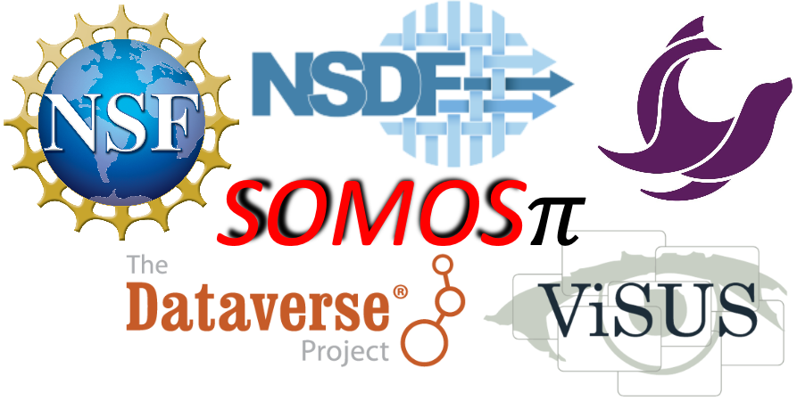

# **NSDF Tutorial: Using NSDF for End-to-End Analysis of Scientific Data**

<p align="center">
    
</p>

<p align="center">
<a href="https://www.python.org/downloads/release/python-310/"></a>
<a href="https://dl.acm.org/doi/10.1145/3588195.3595941"></a>
<a href="https://opensource.org/licenses/Apache-2.0"></a>
<a href="https://nsdf-workspace.slack.com/"></a>
<a href="https://www.docker.com"></a>
<a href="https://github.com/astral-sh/ruff"></a>

## Overview

This tutorial demonstrates the power of [OpenVisus](https://github.com/sci-visus/OpenVisus), one of the many [NSDF](https://nationalsciencedatafabric.org/) services to accelerate the accessibility, study, and visualization of scientific data using both public and private clouds. To guide you through the training, we deploy a use case with an Earth Science Dataset generated by [SOMOSPIE](https://globalcomputing.group/somospie/), an ML-based modular SOil MOisture SPatial Inference Engine. Specifically, we focus on the first stage of SOMOSPIE, called [GEOtiled](https://github.com/TauferLab/GEOtiled), that leverages data partitioning to accelerate the computation of terrain parameters from digital elevation models (DEMs), while preserving accuracy. 

This tutorial follows the next architecture:

<p align="center">
    
</p>

---

### Table of content
  1. [Prerequisites](#prerequisites)
  2. [Docker-compose Execution](#docker-compose-execution)
  3. [Installation](#installation)
  4. [Community](#community)
  5. [Related Publications](#related-publications)
  6. [Copyright and License](#copyright-and-license)
  7. [Authors](#authors)
  8. [Acknowledgments](#acknowledgments)

## Prerequisites

To execute this tutorial, you must have Git and Docker Desktop on your computer.  
* **Install Git**: Follow the instructions [here](https://github.com/git-guides/install-git) and depending on your OS (i.e., Linux, Windows, or Mac) select the installation method. 
* **Install Docker Desktop**: Follow the instructions [here](https://docs.docker.com/engine/install/) and depending on your OS (i.e., Linux, Windows, or Mac) select the installation method.

Verify your installation by opening the terminal on your computer and typing the next commands. 
> :bulb: **Note:** For Windows we recommend using the [PowerShell](https://learn.microsoft.com/en-us/powershell/scripting/overview?view=powershell-7.4) terminal. 
* Verification of Github
```
# Check the Git version
git --version
```
Expected Output: `git version 3.12.0` 

* Verification of Docker Desktop: Before running any Docker commands, please, open the Docker Desktop application. 
```
# Check the Docker information installation 
docker info
```
Expected Output: 
> Note: The numbers might change depending on your installation and more information can be displayed.
```
Client:
 Version:    24.0.5
 Context:    default
 Debug Mode: false

Server:
 Containers: 120
  Running: 0
  Paused: 0
  Stopped: 120
 Images: 48
```
## Docker-compose Execution

There is a Docker container [`globalcomputinglab/somospie_openvisus`](https://hub.docker.com/repository/docker/globalcomputinglab/somospie_openvisus/general) with all the software stack required to facilitate the execution of this tutorial. After installing Docker Desktop as listed in the [Prerequisites](#prerequisites), **please open the Docker Desktop application on your computer.**   

**Open your terminal** and follow the next instructions to execute the tutorial using the Docker container. 
```
# Clone the repository
git clone https://github.com/nsdf-fabric/Openvisus_Tutorial.git

# Change directory 
cd Openvisus_Tutorial

# Start docker compose
docker-compose up -d
```

Then **open your preferred browser (i.e., Google Chrome, Firefox, Safari)** and paste the next URL to access Jupyter Lab (Tutorial.ipynb)

```
# Access to Jupyter Lab (Tutorial.ipynb)
http://127.0.0.1:5000/lab/tree/Tutorial.ipynb
```
Once you have completed the execution of the tutorial, you need to stop the docker container. **Open your terminal** and enter the next command. 
```
# Stop the docker container
docker-compose down
```

## Installation

There are two ways to install and run the tutorial: i) [Using your local machine](#using-your-local-machine) and ii) [Using a docker container](#using-a-docker-container)

### Using your local machine

[Conda](https://www.anaconda.com/download/) is used to control all the dependencies in this project; the file `environment.yml` contains the list of required versions:

```
# environment.yml

name: somospie
channels:
  - conda-forge
  - defaults
dependencies:
  - python=3.10
  - gdal
  - pip
  - pip:
      - pandas
      - pyspark
      - findspark
      - scikit-learn
      - matplotlib
      - grass-session
      - bokeh
      - xmltodict
      - requests
      - colorcet
      - geopandas
      - tqdm
      - panel
      - jupyterlab
      - grass-session
      - tifffile
      - rasterio
      - imagecodecs
```

To install the dependencies in your local machine, use the following command:

> :bulb: **Note:** Conda is mandatory in this step, use [this](https://www.anaconda.com/download/) link to install it

```
conda env create -f environment.yml
```

Activate the virtual environment:

```
conda activate somospie
```

Install OpenVisus dependencies:

```
# use this file to install openvisus in your local machine
./setup_openvisuspy.sh
```

Run the Jupyter Notebook and follow the internal instructions:

```
jupyter notebook Tutorial.ipynb
```

### Using a Docker container

To build the docker image in your local machine:

```
docker build --platform linux/amd64 -t globalcomputinglab/somospie_openvisus .
```

To pull the image from Dockerhub:

```
docker pull --platform linux/amd64 globalcomputinglab/somospie_openvisus:latest
```

To run:

```
docker run -d -p 5000:5000 -p 8989:8989 --name tutorial --platform linux/amd64 globalcomputinglab/somospie_openvisus
```

Follow this URL to run the Jupyter Notebook `Tutorial.ipynb`:

```
http://localhost:5000/
```

## Community

OpenVisus is an open-source project. Questions, discussion, and
contributions are welcome. Contributions can be anything from new
packages to bug fixes, documentation, or even new core features.

Resources:

- **Slack workspace**: [nsdf-workspace](https://nsdf-workspace.slack.com/).
- **Github Discussions**: [issues](https://github.com/nsdf-fabric/catalog-comparison-tool/issues): not just for discussions, also Q&A.
- **Mailing list**: [https://groups.google.com/g/nsdf](https://groups.google.com/g/nsdf) - nsdf@googlegroups.com
- **Twitter**: [@FabricNsdf](https://twitter.com/FabricNsdf).

## Related Publications

[1] Roa, C., Olaya, P., Llamas, R., Vargas, R., Taufer, M. GEOtiled: A Scalable Workflow for Generating Large Datasets of High-Resolution Terrain Parameters. Proceedings of the 32nd International Symposium on High-Performance Parallel and Distributed Computing (2023). [link](https://dl.acm.org/doi/abs/10.1145/3588195.3595941)

[2] Olaya, Paula and Luettgau, Jakob and Roa, Camila and Llamas, Richardo and Vargas, Rodrigo and Wen, Sophia and Chung, I-Hsin and Seelam, Seetharami and Park, Yoonho and Lofstead, Jay and others Enabling Scalability in the Cloud for Scientific Workflows: An Earth Science Use Case. IEEE International Conference on Cloud Computing (2023). [link](https://research.ibm.com/publications/enabling-scalability-in-the-cloud-for-scientific-workflows-an-earth-science-use-case)

[3] D. Rorabaugh, M. Guevara, R. Llamas, J. Kitson, R. Vargas, and M. Taufer. SOMOSPIE: A modular SOil MOisture SPatial Inference Engine based on data-driven decisions. In Proceedings of the 2019 15th International Conference on eScience (eScience) (2019). [link](https://ieeexplore.ieee.org/document/9041768)

## Copyright and License

Copyright (c) 2024, Global Computing Lab

Catalog Comparison Tool is distributed under terms of the [Apache License, Version 2.0](http://www.apache.org/licenses/LICENSE-2.0) with LLVM Exceptions.
See [LICENSE](LICENSE) for more details.

## Authors

This project was created by the [NSDF team](https://nationalsciencedatafabric.org/contributors.html) and the SOMOSPIE team. To reach out email us at [info@nationalsciencedatafabric.org](email:info@nationalsciencedatafabric.org) and Dr. Michela Taufer [mtaufer@utk.edu](email:mtaufer@utk.edu). 

## Acknowledgments
The authors of this tutorial would like to express their gratitude to:

* NSF through the awards 2138811, 2103845, 2334945, 2138296, and 2331152.
* The Dataverse team [link](https://dataverse.org/about)
* The Seal Storage team [link](https://www.sealstorage.io/home/#team)
* Vargas Lab led by Dr. Rodrigo Vargas [link](https://www.udel.edu/academics/colleges/canr/departments/plant-and-soil-sciences/faculty-staff/rodrigo-vargas/)

Any opinions, findings, conclusions, or recommendations expressed in this material are those of the author(s) and do not necessarily reflect the views of the National Science Foundation.  

<p align="center">
    
</p>
